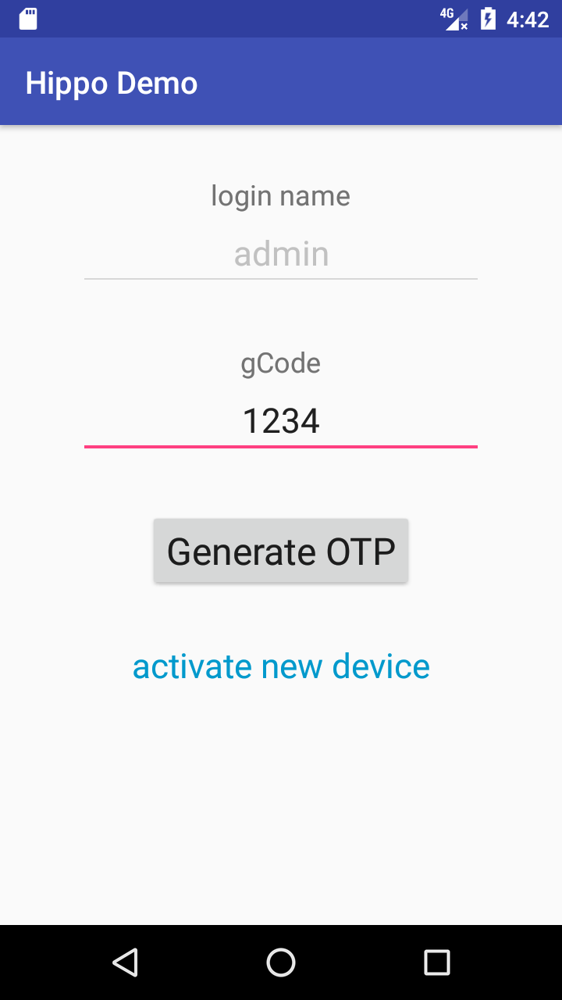
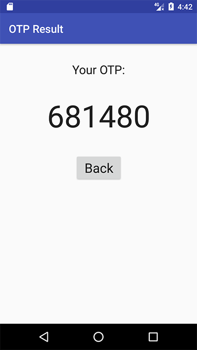

# HippoSecurity Toolkit

HippoSecurity client-side demo project for Android.

## Prerequisite

Please contact HippoSecurity support to obtain your copy of the library  `hippo-lib-release.aar`, and copy the binary file into `~/hippo-lib/` folder in the project.

## Build and run the demo

Open the project with latest version of Android Studio.

The first screen will prompt for `device PIN code` to activate the client, you can use the default value for trail purpose.

Once the client is activated, the main screen will wait for user to enter `gCode`, which you can see in Linux console if you run the `hippo-demo-linux` project.

User enter `gCode` and tap on the `Generate OTP` button, it will jump to the second screen to display generated OTP code:

User can then enter the OTP back to server side for verification.

## License

MIT © HippoSecurity
