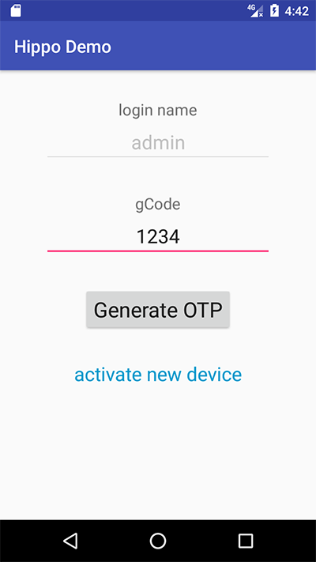

# HippoSecurity Toolkit

HippoSecurity client-side demo project for Android.

## Prerequisite

Please contact HippoSecurity support to obtain your copy of the library  `hippo-lib-release.aar`, and copy it into `~/hippo-lib/` folder of the project.

## Build and run the demo

Clone this repository and open the project with latest version of Android Studio.

Build and run the App. The first screen will prompt for `device PIN code` to activate the client. You can use the default value and tap on the `Activate` button:

Once the client is activated, it will return to the main screen, wait for user to enter `gCode`. You can run the `hippo-demo-linux` project to get this `gCode`:

Tap on the `Generate OTP` button, it will jump to result view with OTP displayed:

Now you can enter this OTP to the Linux console which is waiting for input, and it will verify if your OTP is valid.

## License

MIT © HippoSecurity
